<div align="center">

# 🌌 **THE DATA ALCHEMIST** 🌌
## *Transmuting Raw Data into Golden Insights*


[](https://www.linkedin.com/in/ashaba-jasper-29621b241/)
[](https://twitter.com/ashaba_jasper)
[](mailto:ashabajasper@gmail.com)
[](#)

</div>

---

<div align="center">

## 🚀 **OPERATION: DATA DOMINANCE** 🚀
### *Mission Duration: June 15, 2025 → January 1, 2026*
### **[200 DAYS OF PURE DATA SCIENCE]**


```python
class DataScienceJourney:
    def __init__(self):
        self.start_date = "2025-06-15"
        self.end_date = "2026-01-01"
        self.total_days = 200
        self.status = "ACTIVATED"
        self.mode = "BEAST_MODE"
        self.caffeine_level = float('inf')
        
    def daily_routine(self):
        return [
            "☕ Coffee.compile()",
            "🧠 Brain.train(new_model)",
            "📊 Data.transform(insights)",
            "🚀 Model.deploy(production)",
            "🔁 Repeat until mastery"
        ]
```

</div>

<div align="center">

### 📊 **REAL-TIME MISSION METRICS** 📊

<table>
<tr>
<td align="center" width="20%">

#### 🎯 **FOCUS**


</td>
<td align="center" width="20%">

#### ⚡ **ENERGY**


</td>
<td align="center" width="20%">

#### 🧠 **MODELS**


</td>
<td align="center" width="20%">

#### 📈 **PROGRESS**


</td>
<td align="center" width="20%">

#### 🔥 **STREAK**


</td>
</tr>
</table>

</div>

---

## 🎭 **THE PROTAGONIST**


### 🧪 **Bio.execute()**

```javascript
const AshabaJasper = {
    identity: "Data Alchemist & Code Composer",
    currentQuest: "Mastering the Art of Artificial Intelligence",
    dailyMantra: "In Data We Trust, In Code We Build",
    
    superpowers: [
        "🔮 Pattern Recognition (Level: Expert)",
        "⚗️ Feature Engineering (Level: Wizard)",
        "🎯 Model Optimization (Level: Ninja)",
        "🎨 Data Visualization (Level: Artist)",
        "🎹 Piano Playing (Level: Maestro)"
    ],
    
    currentMission: {
        name: "Operation Data Dominance",
        duration: "200 days",
        objectives: ["Master MLOps", "Deploy 50 Models", "Impact 1M+ Lives"]
    },
    
    philosophy: "Every dataset tells a story. My job is to be its translator."
};
```

### 🎼 **The Harmony of Data & Music**
> *"I find algorithms in music and melodies in data. Both are about recognizing patterns, creating harmony, and orchestrating complexity into beautiful simplicity."*

---

## 🛠️ **TECH ARSENAL & WEAPONRY**

<div align="center">

### ⚔️ **Primary Weapons**

<table>
<tr>
<td align="center" width="33%">

#### 🐍 **PYTHON MASTERY**


**Damage:** ⚔️⚔️⚔️⚔️⚔️  
**Special Abilities:**
- Data Manipulation Magic
- ML/DL Spell Casting
- Automation Enchantments

</td>
<td align="center" width="33%">

#### 🧠 **NEURAL NETWORKS**


**Damage:** ⚔️⚔️⚔️⚔️⚔️  
**Special Abilities:**
- Deep Learning Sorcery
- Computer Vision
- NLP Wizardry

</td>
<td align="center" width="33%">

#### 📊 **DATA ALCHEMY**


**Damage:** ⚔️⚔️⚔️⚔️  
**Special Abilities:**
- Statistical Inference
- Predictive Modeling
- Insight Extraction

</td>
</tr>
</table>

### 🎯 **Skill Matrix**

<details>
<summary><b>🔥 Click to Reveal Full Power Level 🔥</b></summary>

#### **🎮 POWER LEVELS**

```
📊 Data Manipulation     [████████████████████] 100% - LEGENDARY
🤖 Machine Learning      [█████████████████░░░] 85%  - MASTER
🧠 Deep Learning        [████████████████░░░░] 80%  - EXPERT
📈 Data Visualization   [████████████████████] 100% - LEGENDARY
☁️  Cloud Architecture   [██████████████░░░░░░] 70%  - ADVANCED
🔧 MLOps               [████████████░░░░░░░░] 60%  - PROFICIENT
📝 Technical Writing    [█████████████████░░░] 85%  - MASTER
🎹 Piano Skills        [████████████████████] 100% - VIRTUOSO
```

#### **🛡️ DEFENSIVE STATS**
- **Debug Resistance:** 95%
- **Coffee Dependency:** 200%
- **Stack Overflow Fu:** Master Level
- **Imposter Syndrome Shield:** Activated

</details>

</div>

---

## 🎯 **MISSION OBJECTIVES**

<div align="center">

### 📋 **THE GRAND CHECKLIST OF DESTINY**

<table>
<tr>
<td width="25%">

### 🏆 **ACHIEVEMENTS**
- [ ] 🎖️ AWS ML Specialty
- [ ] 🥇 Kaggle Expert Status
- [ ] 🎤 Conference Speaker
- [ ] 📚 Published Papers: 3
- [ ] 🌟 10K GitHub Stars

</td>
<td width="25%">

### 🚀 **DEPLOYMENTS**
- [ ] 🤖 50 Production Models
- [ ] 📊 Real-time Analytics Platform
- [ ] 🧠 AI-Powered SaaS Product
- [ ] 🔮 Predictive API Service
- [ ] 💡 Open Source ML Tool

</td>
<td width="25%">

### 📚 **KNOWLEDGE QUESTS**
- [ ] 🧮 Causal Inference Mastery
- [ ] 🎯 Reinforcement Learning
- [ ] 🔬 Quantum ML Basics
- [ ] 🏗️ MLOps Architecture
- [ ] 🎨 Advanced Visualizations

</td>
<td width="25%">

### 💰 **IMPACT METRICS**
- [ ] 👥 1M+ Lives Impacted
- [ ] 💵 $10M+ Value Created
- [ ] 🌍 3 Industry Solutions
- [ ] 📈 5 Business Transformations
- [ ] 🤝 100+ Collaborations

</td>
</tr>
</table>

</div>

---

## 🎮 **FEATURED BOSS BATTLES** *(Projects)*

<div align="center">

<table>
<tr>
<td width="50%" align="center">

### 🐉 **PROJECT: DRAGON SLAYER**
*Predictive Analytics Engine*


**Quest:** Build an end-to-end predictive analytics platform that can forecast business metrics with 95%+ accuracy

**Tech Stack:** Python • TensorFlow • Spark • Airflow • Docker

[⚔️ Enter the Dungeon](https://github.com/AshabaJasper)

</td>
<td width="50%" align="center">

### 👁️ **PROJECT: OMNISCIENT**
*Real-time Anomaly Detection*


**Quest:** Create an ML system that detects anomalies in streaming data with sub-second latency

**Tech Stack:** Kafka • Flink • PyTorch • Kubernetes • Grafana

[🔍 View Blueprint](https://github.com/AshabaJasper)

</td>
</tr>
<tr>
<td width="50%" align="center">

### 🧙‍♂️ **PROJECT: MIND READER**
*NLP Sentiment Analysis API*


**Quest:** Deploy a production-ready sentiment analysis API handling 10K+ requests/minute

**Tech Stack:** BERT • FastAPI • Redis • PostgreSQL • AWS

[📖 Read the Prophecy](https://github.com/AshabaJasper)

</td>
<td width="50%" align="center">

### 🎯 **PROJECT: PRECOG**
*Customer Lifetime Value Predictor*


**Quest:** Predict customer lifetime value with advanced ensemble methods and causal inference

**Tech Stack:** XGBoost • LightGBM • MLflow • Feast • dbt

[🔮 Peer into the Future](https://github.com/AshabaJasper)

</td>
</tr>
</table>

</div>

---

## 📈 **PERFORMANCE ANALYTICS**

<div align="center">

### 🎯 **GitHub Combat Stats**


<table>
<tr>
<td width="50%">

</td>
<td width="50%">

</td>
</tr>
</table>

### 💻 **Language Proficiency**


### 📊 **Contribution Graph**


</div>

---

## 🌟 **DAILY QUESTS & SIDE MISSIONS**

<div align="center">

### 📅 **THE SACRED ROUTINE**

```mermaid
graph LR
    A[🌅 5:00 AM] -->|Wake Up| B[☕ Coffee Ritual]
    B --> C[📚 Paper Reading Hour]
    C --> D[💻 Code Sprint #1]
    D --> E[🧠 Model Training]
    E --> F[🍜 Lunch & Learn]
    F --> G[📊 Data Exploration]
    G --> H[🚀 Deployment Tasks]
    H --> I[📝 Blog/Documentation]
    I --> J[🎹 Piano Practice]
    J --> K[🌙 Sleep Protocol]
    
    style A fill:#FF6B6B
    style B fill:#4ECDC4
    style C fill:#45B7D1
    style D fill:#96CEB4
    style E fill:#FECA57
    style F fill:#FF9FF3
    style G fill:#54A0FF
    style H fill:#48DBFB
    style I fill:#1DD1A1
    style J fill:#FF6B9D
    style K fill:#C44569
```



### 🎲 **RANDOM ENCOUNTERS**

| Day | Challenge | Reward |
|-----|-----------|---------|
| Monday | 🐛 Debug a Neural Network | +50 XP |
| Tuesday | 📊 Visualize Complex Data | +30 XP |
| Wednesday | 🤖 Optimize Model Performance | +40 XP |
| Thursday | 📚 Read & Implement Paper | +60 XP |
| Friday | 🚀 Deploy to Production | +100 XP |
| Weekend | 🎯 Kaggle Competition | +200 XP |

</div>

---

## 📚 **KNOWLEDGE SCROLLS** *(Latest Blog Posts)*

<div align="center">

### 📖 **Recent Transmissions**

| 📅 Date | 🎯 Title | 🏷️ Tags |
|---------|----------|---------|
| Coming Soon | **"The Art of Feature Alchemy"** | `Feature Engineering` `ML` `Python` |
| Coming Soon | **"Neural Networks: A Musical Perspective"** | `Deep Learning` `Music` `Theory` |
| Coming Soon | **"MLOps: From Chaos to Orchestra"** | `MLOps` `DevOps` `Production` |
| Coming Soon | **"Causal Inference for Mortals"** | `Statistics` `Causal AI` `Business` |

</div>

---

## 🤝 **GUILD CONNECTIONS**

<div align="center">

### 🌐 **Join My Party**

<table>
<tr>
<td align="center">
<a href="https://www.linkedin.com/in/ashaba-jasper-29621b241/">

</a>
</td>
<td align="center">
<a href="https://twitter.com/ashaba_jasper">

</a>
</td>
<td align="center">
<a href="mailto:ashabajasper@gmail.com">

</a>
</td>
</tr>
</table>

### 💬 **COMMUNICATION PROTOCOL**

```python
def start_conversation():
    topics = [
        "🧠 Machine Learning Architectures",
        "📊 Data Pipeline Optimization",
        "🎹 The Mathematics of Music",
        "🚀 Production ML Challenges",
        "💡 Innovative Project Ideas",
        "☕ Best Coffee for Coding Sessions"
    ]
    
    return random.choice(topics)

# Initialize connection...
print(f"Let's talk about: {start_conversation()}")
```

</div>

---

## 🎖️ **BADGES OF HONOR**

<div align="center">


### 🏅 **SPECIAL ACHIEVEMENTS**

<table>
<tr>
<td align="center">

</td>
<td align="center">

</td>
<td align="center">

</td>
<td align="center">

</td>
</tr>
</table>

</div>

---

## 💎 **SUPPORT THE QUEST**

<div align="center">

### ⚡ **Power-Ups Available**

<a href="https://www.buymeacoffee.com/ashabajasper">

</a>

<a href="https://github.com/sponsors/AshabaJasper">

</a>

</div>

---

<div align="center">

## 🌌 **EPILOGUE**

### *"The Journey of 200 Days"*

> In the realm of data, where patterns hide and insights sleep,  
> A warrior rises, with algorithms deep.  
> Two hundred days of code and sweat,  
> No challenge too great, no goal unmet.  
> 
> From scattered bytes to wisdom clear,  
> Through neural paths, the future appears.  
> Each model trained, each insight found,  
> Echoes of progress, a triumphant sound.  
> 
> So join me now, in this epic quest,  
> Where data science is put to test.  
> Together we'll build, together we'll grow,  
> In the garden of knowledge, watch genius flow.

### 🚀 **MISSION STATUS: ACTIVE**


</div>

<!-- 
╔══════════════════════════════════════════════════════════╗
║                   DEVELOPER NOTES                         ║
╠══════════════════════════════════════════════════════════╣
║                                                           ║
║  Mission Start: Sunday, June 15, 2025                    ║
║  Mission End: Thursday, January 1, 2026                  ║
║  Total Days: 200                                         ║
║                                                           ║
║  Daily Update Checklist:                                 ║
║  □ Update progress badge (Mission Days)                  ║
║  □ Update streak counter                                 ║
║  □ Update project statuses                              ║
║  □ Log daily achievements                               ║
║  □ Update real-time metrics                             ║
║                                                           ║
║  Weekly Tasks:                                          ║
║  □ Add new blog post entry                              ║
║  □ Update skill power levels                            ║
║  □ Review and update objectives                         ║
║  □ Screenshot progress for archives                     ║
║                                                           ║
║  Remember: This is more than code.                      ║
║  This is a transformation. Make it legendary.           ║
║                                                           ║
╚══════════════════════════════════════════════════════════╝
-->
