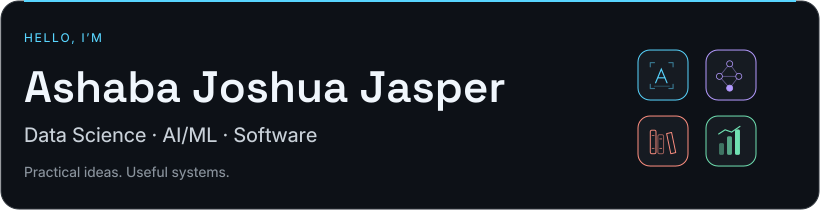
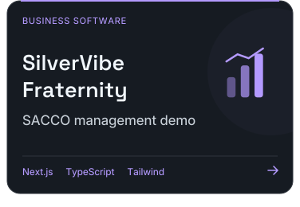
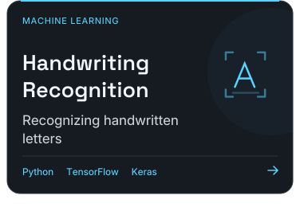
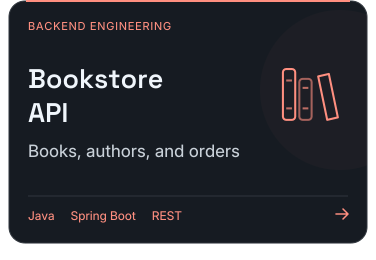
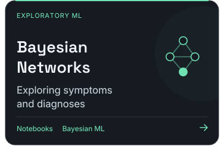
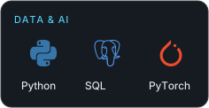
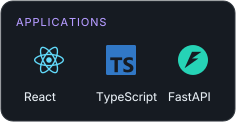
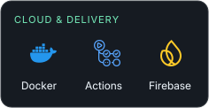

  <picture>
    <source media="(max-width: 600px)" srcset="./assets/hero-mobile.svg" />
    
  </picture>

  Kampala, Uganda · Founder, <a href="https://persmontechnologies.com">Persmon Technologies</a>  
  <a href="#selected-projects"><strong>Explore projects ↗</strong></a> &nbsp; · &nbsp;
  <a href="mailto:ashabajasper@gmail.com"><strong>Contact me ↗</strong></a>

## Selected projects

  <a href="https://github.com/AshabaJasper/SilverVibe-Fraternity"><picture><source media="(max-width: 600px)" srcset="./assets/silvervibe-mobile.svg" /></picture></a>
  <a href="https://github.com/AshabaJasper/Handwriting-Recognition-in-Python"><picture><source media="(max-width: 600px)" srcset="./assets/handwriting-mobile.svg" /></picture></a>
  <a href="https://github.com/AshabaJasper/Bookstore-Inventory-API"><picture><source media="(max-width: 600px)" srcset="./assets/bookstore-mobile.svg" /></picture></a>
  <a href="https://github.com/AshabaJasper/Medical-Diagnosis-with-Bayseian-Networks"><picture><source media="(max-width: 600px)" srcset="./assets/bayesian-mobile.svg" /></picture></a>

  Source: <a href="https://github.com/AshabaJasper/SilverVibe-Fraternity">SilverVibe</a> · <a href="https://github.com/AshabaJasper/Handwriting-Recognition-in-Python">Handwriting</a> · <a href="https://github.com/AshabaJasper/Bookstore-Inventory-API">Bookstore API</a> · <a href="https://github.com/AshabaJasper/Medical-Diagnosis-with-Bayseian-Networks">Bayesian Networks</a> 
  <a href="https://github.com/AshabaJasper?tab=repositories">All repositories ↗</a>

## Toolkit

  
  
  

More tools

**Data & analytics:** Pandas · NumPy · scikit-learn · TensorFlow · Power BI · Tableau  
**Applications & cloud:** Django · JavaScript · Azure

## About

I build practical systems across data science, applied AI, and software engineering. At **[Persmon Technologies](https://persmontechnologies.com)**, I focus on analytics, automation, and business software.

**Exploring:** MLOps · data engineering · applied AI.

## GitHub activity

  

More activity: streaks, languages, and stats

  

  
  
  
  

External cards may lag or omit private and organization work. Language charts show activity, not proficiency. Times use UTC+3.

## Connect

Have a project in mind? **[Let's talk ↗](mailto:ashabajasper@gmail.com)**

[Email](mailto:ashabajasper@gmail.com) · [LinkedIn](https://linkedin.com/in/ashaba-jasper) · [X](https://x.com/ashaba_jasper) · [Persmon Technologies](https://persmontechnologies.com)
